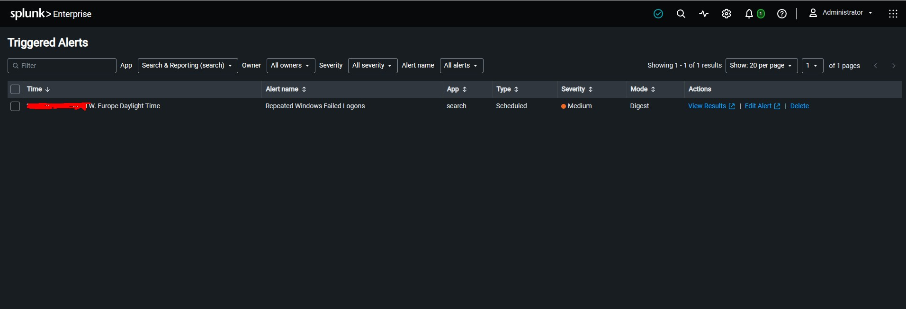

# Detection 001 — Repeated Windows Failed Logons

## Status

**Validated — PowerShell + Splunk SIEM**

This detection was successfully executed against controlled Windows Security log data, reproduced in Splunk, saved as a scheduled alert, and observed in Splunk Triggered Alerts when the threshold was reached.

## Detection Objective

Identify a burst of repeated Windows authentication failures that may indicate password guessing, brute-force activity, a misconfigured service, or repeated user error.

## Data Source

- Windows Security Event Log
- Event ID: **4625** — failed logon
- Splunk index: `soc_lab`
- Portfolio host label: `SOC-LAB-WIN01`

## Detection Logic

Trigger an alert when:

> **5 or more Event ID 4625 failed-logon events occur within a 2-minute window.**

### Conceptual Rule

```text
IF EventID = 4625
AND failed_logon_count >= 5
WITHIN 2 minutes
THEN generate alert
```

## PowerShell Validation

Run PowerShell with permission to read the Windows Security log.

```powershell
$events = @(Get-WinEvent -FilterHashtable @{
    LogName='Security'
    Id=4625
    StartTime=(Get-Date).AddHours(-2)
} | Sort-Object TimeCreated)

$alertFound = $false

for ($i = 0; $i -lt $events.Count; $i++) {
    $windowStart = $events[$i].TimeCreated
    $windowEnd   = $windowStart.AddMinutes(2)

    $count = @(
        $events | Where-Object {
            $_.TimeCreated -ge $windowStart -and
            $_.TimeCreated -le $windowEnd
        }
    ).Count

    if ($count -ge 5) {
        Write-Output "ALERT: $count failed logons detected within 2 minutes"
        $alertFound = $true
        break
    }
}

if (-not $alertFound) {
    Write-Output "No threshold breach detected"
}
```

The output intentionally avoids printing usernames, hostnames, or exact timestamps so validation can be documented without exposing unnecessary identifiers.

### PowerShell Validation Result

Observed output:

```text
ALERT: 5 failed logons detected within 2 minutes
```

**Result:** Detection triggered as expected.

## Splunk SPL Validation

Windows Security events were ingested into the dedicated `soc_lab` index and the repeated-failure threshold was validated using SPL.

```spl
index=soc_lab EventCode=4625
| sort 0 + _time
| streamstats time_window=2m count as failed_logons
| where failed_logons>=5
| head 1
| table failed_logons
```

Observed result:

```text
failed_logons
5
```

**Result:** The SPL correlation logic detected the five-event threshold within the two-minute window.

## Splunk Scheduled Alert

The validated search was saved as a Splunk scheduled alert with the following configuration:

| Setting | Value |
|---|---|
| Alert name | Repeated Windows Failed Logons |
| Alert type | Scheduled |
| Search window | Last 2 minutes |
| Schedule | Every minute |
| Trigger condition | Number of Results > 0 |
| Trigger mode | Once |
| Throttle | 5 minutes |
| Severity | Medium |
| Action | Add to Triggered Alerts |

A fresh controlled set of five failed-authentication events was generated after the alert was enabled. Splunk ingested the events, evaluated the SPL search, and the alert appeared successfully in **Triggered Alerts**.

### Visual Evidence

The sanitized screenshot below shows the scheduled detection appearing in Splunk **Triggered Alerts**. The exact trigger timestamp was redacted before publication.



**End-to-end validation:**

```text
Windows Event ID 4625
        ↓
Splunk ingestion
        ↓
SPL threshold correlation
        ↓
Scheduled detection
        ↓
Triggered Alert
```

## Triage Guidance

If this alert occurs unexpectedly in a production environment, an analyst should review:

1. Whether the same account is being targeted repeatedly.
2. Whether the failures originate from the same source system or IP address.
3. Whether a successful logon (Event ID 4624) follows the failures.
4. Whether privileged or service accounts are involved.
5. Whether the source is expected business activity, user error, or suspicious authentication behavior.

## Potential False Positives

- A user repeatedly typing the wrong password.
- Saved credentials that are no longer valid.
- A scheduled task or service using an outdated password.
- Legitimate administrative testing.

## Severity

**Default:** Medium

Severity should be increased when privileged accounts, unknown external sources, many target accounts, or a successful authentication following repeated failures are observed.

## MITRE ATT&CK

**T1110.001 — Brute Force: Password Guessing**

This mapping represents behavior the rule is designed to detect. A detection match alone does not prove malicious activity.

## Privacy

Public documentation intentionally avoids real local usernames, hostnames, account domains, credentials, public IP addresses, and unnecessary exact timestamps.

## Next Step

Expand the lab with additional SOC detections and, where available, reproduce selected detections in Microsoft Sentinel using KQL.
