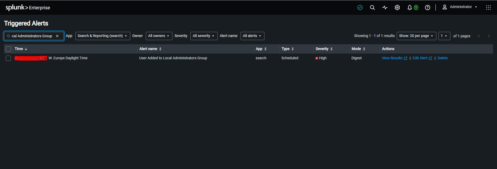

# Detection 005 — User Added to Local Administrators Group

## Status

**Validated — Splunk Scheduled Alert**

This detection identifies Windows Security Event ID **4732** when an account is added to the built-in local **Administrators** group.

Membership in the local Administrators group grants elevated privileges on the system. This activity can be legitimate during approved administration or provisioning, but unexpected additions should be reviewed promptly because they may indicate privilege escalation or persistence.

## Data Source

- Windows Security Event Log
- Event ID **4732** — A member was added to a security-enabled local group
- Built-in Administrators SID: `S-1-5-32-544`
- Splunk index: `soc_lab`

## Detection Objective

Identify membership additions to the local Administrators group and surface them for analyst review.

## SPL Detection Query

```spl
index=soc_lab EventCode=4732 "S-1-5-32-544"
| eval group_name="LOCAL_ADMINISTRATORS"
| eval added_member="REDACTED_ACCOUNT"
| stats count AS admin_group_additions BY group_name added_member
```

The public-facing result intentionally replaces the real account name with `REDACTED_ACCOUNT`.

## Validation Result

A controlled lab account was temporarily added to the local Administrators group and then removed. Splunk returned:

```text
group_name             added_member        admin_group_additions
LOCAL_ADMINISTRATORS   REDACTED_ACCOUNT    1
```

**Result:** Event ID 4732 for the local Administrators group was successfully ingested and detected in Splunk.

## Splunk Scheduled Alert

The validated query was saved as a scheduled Splunk alert with the following configuration:

| Setting | Value |
|---|---|
| Alert name | User Added to Local Administrators Group |
| Alert type | Scheduled |
| Search window | Last 5 minutes |
| Schedule | Every 5 minutes |
| Trigger condition | Number of Results > 0 |
| Trigger mode | Once |
| Throttle | 10 minutes |
| Severity | High |
| Action | Add to Triggered Alerts |

A fresh controlled group-membership addition was generated after the alert was enabled. Splunk ingested Event ID 4732, evaluated the detection, and the alert appeared successfully in **Triggered Alerts** with **High** severity.

## Visual Evidence

The sanitized screenshot below shows Detection 005 appearing in Splunk **Triggered Alerts** with **High** severity. The exact trigger timestamp was redacted before publication.



## End-to-End Validation

```text
Account added to Local Administrators
               ↓
Windows Event ID 4732
               ↓
Splunk ingestion
               ↓
SPL detection
               ↓
Scheduled alert
               ↓
Triggered Alert (High)
```

## Triage Guidance

If this alert occurs unexpectedly in a production environment, review:

1. Which account was added to the group.
2. Which user or administrative process initiated the change.
3. Whether the change matches an approved administrative request.
4. Whether the new member is a normal administrator, service account, or newly created account.
5. Whether the account performs unusual authentication or process activity after the privilege change.
6. Whether related account-creation or group-membership events occurred near the same time.

## Potential False Positives

- Approved administrator provisioning.
- IT support activity.
- Temporary maintenance or troubleshooting.
- Automated endpoint-management workflows.
- Security lab activity.

## Severity

**Default: High**

High severity is appropriate because the activity grants local administrative privileges. Severity can be reduced when the change is verified as part of an approved administrative workflow.

## MITRE ATT&CK

- **T1098.007 — Account Manipulation: Additional Local or Domain Groups**
- Tactics: **Persistence, Privilege Escalation**

MITRE ATT&CK specifically notes that accounts may be added to the local Administrators group on Windows to maintain elevated privileges. The mapping describes the behavior represented by this telemetry and does not prove malicious activity.

## Privacy

Public documentation intentionally excludes or redacts real account names, hostnames, account domains, credentials, public IP addresses, exact trigger timestamps, and other unnecessary identifying information.
