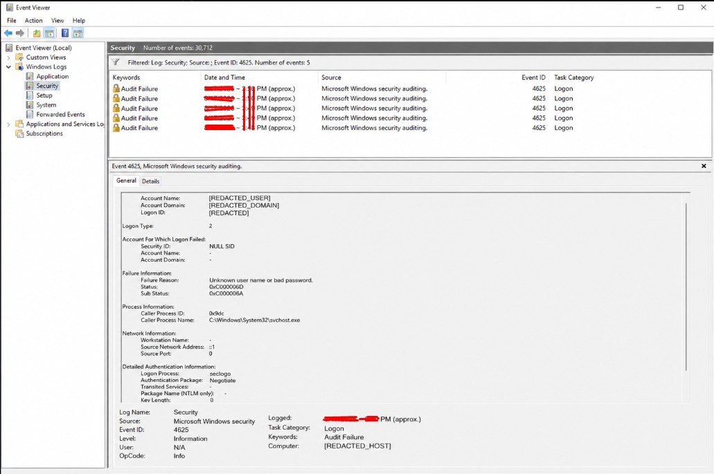

# Investigation 001 — Windows Failed Login Analysis

## Status

**Completed — Controlled Lab Simulation**

## Privacy Note

This is a public portfolio report. Local usernames, hostnames, account domains, exact timestamps, credentials, and other unnecessary identifying information are intentionally redacted or generalized.

## Scenario

Repeated failed authentication attempts were intentionally generated in an authorized Windows lab environment to practice SOC alert triage and Windows Security Event Log analysis.

The activity was generated locally and was not a real attack.

## Primary Evidence Source

Windows Security Event Log — Event ID **4625** (`An account failed to log on`).

## Evidence Summary

| Field | Observed Value |
|---|---|
| Event ID | 4625 |
| Number of failed events | 5 |
| Time window | Approximately 2 minutes |
| Computer | `[REDACTED_HOST]` |
| Subject account | `[REDACTED_USER]` |
| Subject domain | `[REDACTED_DOMAIN]` |
| Logon Type | 2 — Interactive |
| Failure Reason | Unknown user name or bad password |
| Status | 0xC000006D |
| Sub Status | 0xC000006A |
| Caller Process | `C:\Windows\System32\svchost.exe` |
| Logon Process | seclogo |
| Authentication Package | Negotiate |
| Source Network Address | `::1` (local loopback) |
| Source Port | 0 |
| Failed target-account field | Not populated (`-`) in the captured event |

## Visual Evidence

The screenshot below shows the Event Viewer Security log filtered to Event ID **4625**, including the five failed authentication events captured during the controlled test. Identifying fields were redacted before publication.

## Analyst Findings

### 1. Multiple authentication failures occurred

Five Event ID 4625 records were observed within approximately two minutes. A cluster of repeated failed authentication events is a pattern that a SOC analyst should investigate rather than reviewing a single event in isolation.

### 2. Authentication failed because of invalid credentials

The event reported:

- **Status:** `0xC000006D`
- **Sub Status:** `0xC000006A`
- **Failure Reason:** `Unknown user name or bad password.`

The more specific sub-status indicates a bad password condition.

### 3. The logon was interactive

**Logon Type 2** represents an interactive logon. This means the authentication attempt was associated with an interactive local logon context rather than a typical remote network logon such as Logon Type 3.

### 4. The activity originated locally

The source network address was `::1`, the IPv6 loopback address. This indicates that the observed authentication activity originated from the same host rather than from an external network address.

The source port was `0`, which is also consistent with this local authentication scenario.

### 5. Process context

The event recorded:

- Caller process: `C:\Windows\System32\svchost.exe`
- Logon process: `seclogo`
- Authentication package: `Negotiate`

These values were documented as supporting context for the investigation. No conclusion of malicious process execution was made from these fields alone.

## SOC Triage Assessment

| Triage Item | Assessment |
|---|---|
| Alert validity | Valid authentication-failure activity |
| Malicious activity | No — controlled lab simulation |
| External source | No |
| Repeated failures | Yes — 5 events |
| Severity | Low |
| Escalation required | No |
| Classification | Benign / Authorized Security Test |

## MITRE ATT&CK Mapping

**Simulated behavior:** [T1110.001 — Brute Force: Password Guessing](https://attack.mitre.org/techniques/T1110/001/)

The repeated incorrect-password attempts in this lab resemble password-guessing behavior. This mapping describes the behavior being simulated; it does **not** mean that a real adversary was present on the system.

## Recommended Response in a Real SOC

If the same pattern appeared unexpectedly in a production environment, an analyst should:

1. Confirm the affected account and authentication source.
2. Determine the number and frequency of failed attempts.
3. Review the source IP or workstation and determine whether it is expected.
4. Look for successful logons (Event ID 4624) following the failures.
5. Check whether the account became locked out and review account-lockout events where applicable.
6. Correlate the activity with endpoint, SIEM, firewall, VPN, or identity-provider telemetry.
7. Escalate if the source is unknown, failures continue, privileged accounts are targeted, or a successful authentication follows suspicious failures.

## Conclusion

The investigation successfully identified and analyzed a controlled sequence of five Windows failed-logon events.

The evidence showed repeated **Event ID 4625** authentication failures, **Logon Type 2**, invalid-password status information, and a local loopback source. Because the activity was intentionally generated as part of the authorized lab, the final disposition is **Benign / Authorized Security Test**.

This investigation demonstrates practical experience with Windows Security logs, authentication-event analysis, SOC triage, evidence interpretation, MITRE ATT&CK mapping, and incident documentation while preserving operational privacy.
