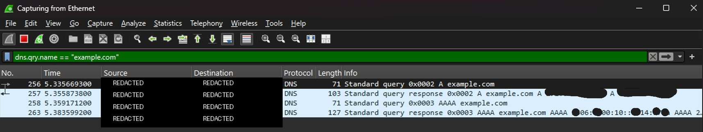

# Investigation 002 — DNS Traffic Analysis with Wireshark

## Status

**Completed — Controlled / Authorized Network Analysis**

This investigation documents a small DNS traffic-analysis exercise performed on an authorized local system using Wireshark.

## Objective

Capture and analyze a controlled DNS lookup in order to practice:

- Network-packet capture
- DNS traffic filtering
- Query/response analysis
- Basic network-investigation workflow
- Evidence sanitization for public documentation

## Scope and Ethics

The activity was generated intentionally from the analyst's own authorized system. No third-party traffic was targeted, intercepted, manipulated, or exploited.

The test used the public domain `example.com` and an explicit DNS resolver address.

## Tooling

- Wireshark
- Windows Command Prompt
- DNS / UDP port 53 traffic

## Controlled Activity

A fresh packet capture was started on the active Ethernet interface. A controlled DNS lookup was then generated with:

```cmd
nslookup example.com 1.1.1.1
```

The capture was filtered in Wireshark with:

```text
dns.qry.name == "example.com"
```

## Observed Traffic

The filtered capture showed four relevant DNS packets:

1. DNS **A** query for `example.com`
2. DNS **A** response
3. DNS **AAAA** query for `example.com`
4. DNS **AAAA** response

This confirmed the expected DNS request/response behavior for both IPv4 and IPv6 address resolution.

## Analyst Findings

- The endpoint generated DNS requests for `example.com` as expected.
- Both A and AAAA record lookups were observed.
- Matching DNS responses were returned for both query types.
- The activity was consistent with normal, benign DNS resolution.
- No suspicious behavior was identified in this controlled exercise.

## SOC Relevance

DNS analysis is useful during SOC investigations because DNS telemetry can help analysts understand which domains an endpoint attempted to resolve and correlate network activity with other security events.

In a real investigation, additional context would be required before classifying a domain lookup as malicious or benign.

## Classification

**Benign / Authorized Security Lab Activity**

No MITRE ATT&CK technique is assigned to this exercise because the captured behavior represents normal DNS resolution rather than simulated adversary behavior.

## Visual Evidence

The public screenshot was sanitized before publication. Local/private source and destination identifiers, command-line username information, MAC-address details, packet bytes, capture filename, and unrelated system information were excluded or redacted.



## Privacy

Only the minimum information required to demonstrate the analysis is published. The repository does not intentionally expose credentials, real usernames, hostnames, private IP addresses, MAC addresses, or unrelated traffic.

## Conclusion

The controlled DNS lookup was successfully captured and isolated in Wireshark. The exercise demonstrated basic network-traffic analysis, protocol filtering, query/response interpretation, and privacy-conscious evidence handling as part of the SOC analyst lab.
